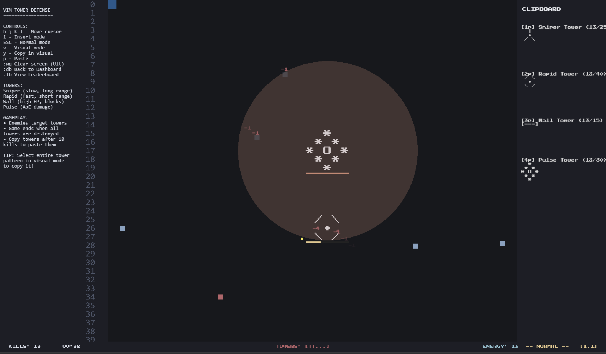
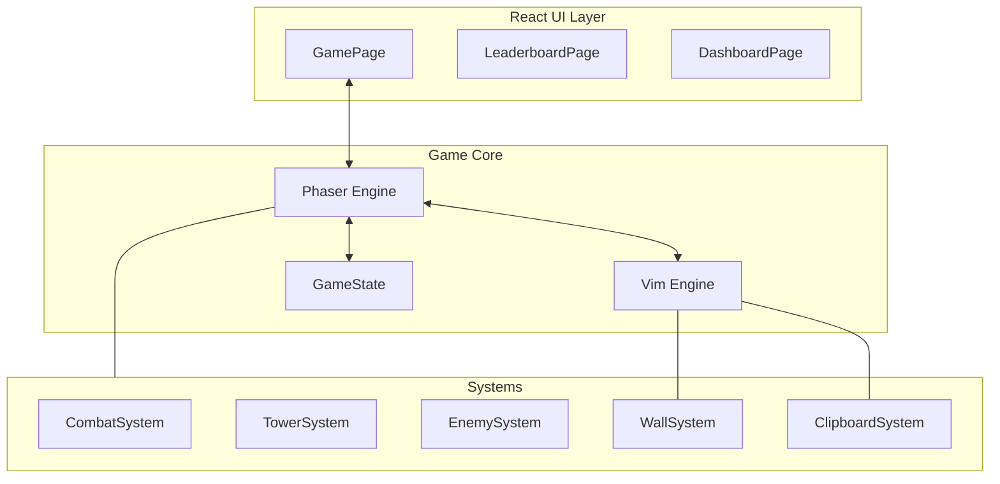

# VimArena

VimArena is a high-octane tower defense game where your battlefield is a functional Vim-like text editor. Navigate, build, and defend using authentic Vim motions, operators, and modes.

**[Play VimArena Online!](https://vim-arena-five.vercel.app/)**



## The Core Concept

In **VimArena**, the text buffer is the physical arena. Every character represents a wall, a component of a tower, or open space. Your efficiency as a defender is directly tied to your fluency with Vim commands.

- **Speed is Survival**: Faster navigation means faster response times.
- **Precision is Power**: Mastery of operators allows for complex battlefield manipulation.
- **The Buffer is Alive**: The map is dynamic and evolves as you type and delete.

---

## New Features & Updates

- **Manual Wall Construction**: Enter Insert Mode (`i`, `a`) and type directly into the buffer to place low-cost, 1-HP walls. Perfect for quick path redirection.
- **Advanced Yank & Paste**: Deploy specialized ASCII towers using `y` to copy and `p` to paste. Each tower has unique range, damage, and fire rates.
- **Strategic Game Over**: The game continues as long as you have combat-capable towers. Survival depends on protecting your infrastructure.
- **Global Leaderboards**: Compete with other Vim masters and see where you rank in terms of survival time and total kills.
- **Hybrid Scaling**: Difficulty scales based on both time and kill count, ensuring a consistently challenging experience.

---

## Project Structure

```text
src/
├── context/         # React context for state sharing between React and Phaser
├── game/            # Core game logic
│   ├── entities/    # Game objects (Enemies, Towers, Projectiles)
│   ├── scenes/      # Phaser scene management
│   ├── systems/     # ECS-like logic (Combat, AI, Economy, Walls)
│   ├── vim/         # Bespoke Vim state machine and command parser
│   ├── GameState.ts # Centralized game metrics and difficulty logic
│   └── main.ts      # Phaser initialization and config
├── pages/           # React UI components (Game, Leaderboard, Dashboard)
├── App.tsx          # Main React entry component
└── main.tsx         # Vite/React entry point
```

---

## Architecture & Integration

VimArena leverages a hybrid architecture, combining the reactive power of **React** for UI with the high-performance rendering of **Phaser 3**, all driven by a custom **Vim Engine**.



---

## Control Reference

### Normal Mode (Navigation)
| Command | Action |
|:---|:---|
| `h` `j` `k` `l` | Move cursor Left, Down, Up, or Right. |
| `w` `b` `e` | Jump to start/end of words. |
| `0` `$` | Jump to beginning or end of the current line. |
| `[count] + motion` | Repeat a motion N times (e.g., `5j` to move 5 lines down). |

### Operators & Actions
| Command | Action |
|:---|:---|
| `v` | Enter **Visual Mode** to select patterns. |
| `y` / `yy` | **Yank** (copy) the current selection or line. |
| `p` / `[count]p` | **Paste** from clipboard slot N (e.g., `1p` for tower slot 1). |
| `d` / `dd` | **Delete** the current selection or line. |
| `c` / `cc` | **Change** (delete and enter Insert Mode). |
| `i` / `a` | Enter **Insert Mode** before/after the cursor. |

### Insert Mode
| Command | Action |
|:---|:---|
| `Esc` | Return to Normal Mode. |
| `Any Char` | Places a **1-HP wall** at the cursor location. |
| `Backspace` | Deletes the character/structure before the cursor. |

---

## Tech Stack

- **Phaser 3**: High-performance game engine for rendering the text grid and effects.
- **React 19**: Modern UI framework for overlays, menus, and leaderboards.
- **Vite**: Ultra-fast build tool and dev server.
- **TypeScript**: Type-safe development for complex game systems.

---

## Getting Started

### 1. Environment Configuration

You need to set up environment variables for both the client and the server.

**Client (Root Directory):**
Create a `.env` file in the root directory:
```env
VITE_GOOGLE_CLIENT_ID=your_google_client_id
VITE_API_URL=http://localhost:3000
```

**Server (`/server` Directory):**
Create a `.env` file in the `server` directory:
```env
MONGODB_URI=your_mongodb_connection_string
PORT=3000
```

### 2. Server Setup

The backend handles the leaderboard and authentication state.
```bash
cd server
npm install
npm start
```

### 3. Client Setup

Run the Phaser game and React UI.
```bash
# From the root directory
npm install
npm run dev
```

